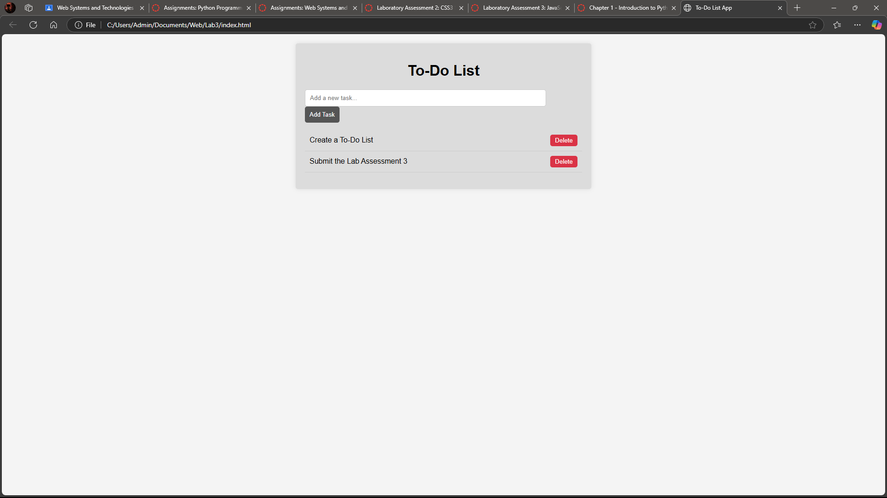

# To-Do List App

## Description
This is a simple interactive to-do list application built with HTML, CSS, and JavaScript. Users can add, delete, and manage their tasks. The tasks are stored in the browser's localStorage, allowing them to persist even after refreshing the page.

## Features
- Add new tasks
- Delete existing tasks
- Tasks are saved in localStorage

## Technologies Used
- HTML
- CSS
- JavaScript (ES6+)

## JavaScript Features Used
- **Arrow Functions**: Used for concise function expressions.
- **Event Listeners**: Used to handle user interactions.
- **LocalStorage**: Used to store tasks persistently.

## Screenshots
1. Adding a task:
   
2. Deleting a task:
   

## How to Run
1. Download the file from repository.
2. Open the index.html in your browser.

## Deployment
The app is hosted on [GitHub Pages](https://yourusername.github.io/your-repo-name).